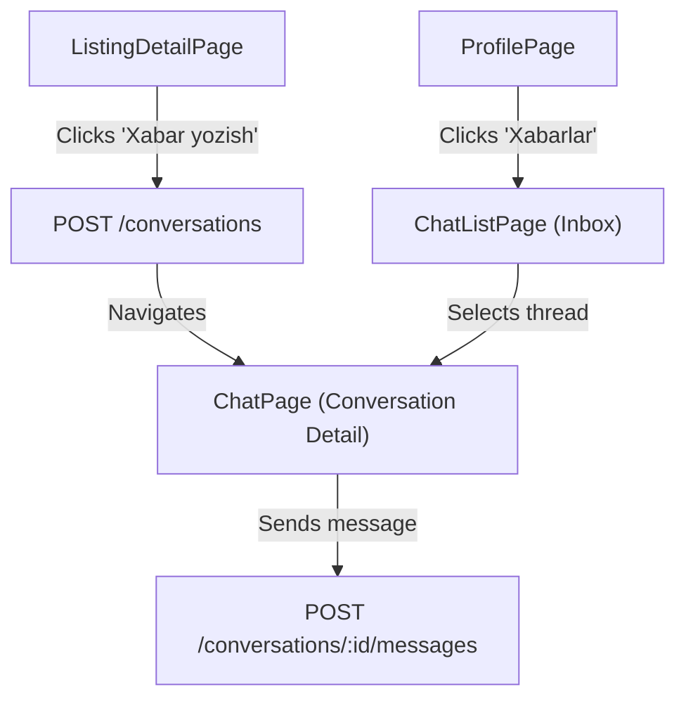

# Qishloq AI — Chat Architecture Decision Document (Step 71)

This document describes the architectural decisions, database models, API endpoints, mobile workflows, and security checklists for implementing the new Chat feature in the Qishloq AI application.

---

## 1. Current Project State

Before proposing the chat system, we audited the current codebase:
* **Authentication**: Fully functional JWT-based authentication (`JwtAuthGuard` in NestJS, secure tokens stored via Riverpod providers in Flutter).
* **Core Entities**: Clear relationships between `User`, `Profile`, and `Listing`.
* **Network Layer**: Flutter mobile app uses `ApiClient` wrapped with custom HTTP interceptors (using Dio), fully prepared for REST interactions.
* **Infrastructure**: Real-time engines (such as WebSockets/Socket.io, Redis adapter for scaling, or WebSocket-enabled API Gateways) and Push Notification services (e.g. Firebase Cloud Messaging) are **not** present in the current MVP scope.
* **Requirements**: Real-time response is not a mandatory requirement for MVP launch. Development speed, simplicity, robust security, and reliability are prioritized.

---

## 2. REST vs WebSocket Comparison

We analyzed two potential architectural models for the messaging system:

| Evaluation Dimension | Variant A: REST Message System | Variant B: WebSocket Chat |
| :--- | :--- | :--- |
| **Real-time Delivery** | Near real-time using manual pull-to-refresh or low-frequency HTTP polling. | Instant real-time message propagation. |
| **Authentication Flow** | Standard `Authorization: Bearer <JWT>` header via HTTP. Built-in `JwtAuthGuard` checks. | Handshake-based token parsing, custom state management for auth expiry. |
| **Development Cost** | Low. Built using standard NestJS controllers and services. | High. Requires custom WebSocket gateways and listeners. |
| **Infrastructure & Scalability** | Low risk. Standard stateless HTTP requests scale out-of-the-box. | High risk. Requires sticky sessions, socket memory management, and Redis adapter for multi-instance scaling. |
| **Mobile Implementation** | Reuses the existing `ApiClient` and state management flows. | Requires managing socket connection state, background timeouts, and reconnect logic. |
| **Testing Effort** | Extremely easy to mock, test via Jest unit tests, Supertest, or Swagger UI. | Requires specialized socket clients and mock connection setups. |
| **MVP Suitability** | **Extremely High**. Solid foundation, low risk, rapid development path. | **Low**. High complexity risk without immediate real-time business need. |

---

## 3. Decision

We will proceed with **Variant A: REST Message System** for the MVP. 

### Rationale:
1. **Infrastructure Simplicity**: Does not require WebSocket setup on NestJS or custom server configurations on the server host.
2. **Reliable Auth & Guards**: Leverages NestJS standard HTTP decorators (`@UseGuards(JwtAuthGuard)`) directly.
3. **Low Client Overhead**: Uses the existing mobile `ApiClient` class without introducing extra state managers for persistent TCP sockets.
4. **Future-Proof**: The proposed DB models and API endpoints are 100% compatible with future WebSocket integration. If real-time features (typing indicators, presence, instant delivery) are added in later stages, the WebSockets layer will sit on top of this exact database schema.

---

## 4. Proposed Database Models (Prisma)

We propose adding the following two models to `schema.prisma`. 

```prisma
model Conversation {
  id        String    @id @default(uuid())
  listingId String
  buyerId   String
  sellerId  String
  createdAt DateTime  @default(now())
  updatedAt DateTime  @updatedAt

  listing   Listing   @relation(fields: [listingId], references: [id], onDelete: Cascade)
  buyer     User      @relation("BuyerConversations", fields: [buyerId], references: [id], onDelete: Cascade)
  seller    User      @relation("SellerConversations", fields: [sellerId], references: [id], onDelete: Cascade)
  messages  Message[]

  @@unique([listingId, buyerId, sellerId])
  @@index([buyerId])
  @@index([sellerId])
  @@index([listingId])
}

model Message {
  id             String       @id @default(uuid())
  conversationId String
  senderId       String
  body           String
  createdAt      DateTime     @default(now())
  readAt         DateTime?

  conversation   Conversation @relation(fields: [conversationId], references: [id], onDelete: Cascade)
  sender         User         @relation(fields: [senderId], references: [id], onDelete: Cascade)

  @@index([conversationId])
  @@index([createdAt])
}
```

### Constraints:
* **Unique Thread Constraint**: `@@unique([listingId, buyerId, sellerId])` prevents duplicate conversations for the same listing between the same buyer and seller.
* **User Constraints** (to be validated at the Service layer):
  1. `buyerId != sellerId`: Users cannot start a conversation with themselves.
  2. Owner verification: The `sellerId` must match the `ownerId` of the listing.

---

## 5. Proposed REST Endpoints

### 5.1. Create/Retrieve Conversation
* **Route**: `POST /conversations`
* **Auth**: Required (JWT)
* **Request Body**:
  ```json
  {
    "listingId": "listing-uuid-here"
  }
  ```
* **Behavior**:
  1. Verifies that the listing is `ACTIVE`.
  2. Verifies that the current user is not the listing owner.
  3. Looks up the listing's `ownerId` (which becomes `sellerId`).
  4. If a conversation with `[listingId, buyerId, sellerId]` already exists, return that existing conversation object.
  5. Otherwise, create a new conversation and return it.

### 5.2. List My Conversations
* **Route**: `GET /conversations/my?page=1&limit=20`
* **Auth**: Required (JWT)
* **Response**: Returns a paginated list of conversations where the current user is either `buyerId` or `sellerId`. Includes listing title, type, and the last message snippet for preview.

### 5.3. Get Messages
* **Route**: `GET /conversations/:id/messages?page=1&limit=30`
* **Auth**: Required (JWT)
* **Behavior**:
  1. Verifies that the current user is either the `buyerId` or `sellerId` of the conversation.
  2. Returns a paginated list of messages sorted by `createdAt` descending.
  3. Implicitly updates `readAt = now()` for all unread messages in this conversation sent by the *other* participant.

### 5.4. Send Message
* **Route**: `POST /conversations/:id/messages`
* **Auth**: Required (JWT)
* **Request Body**:
  ```json
  {
    "body": "Assalomu alaykum, e'lon bo'yicha yozayotgan edim."
  }
  ```
* **Behavior**:
  1. Verifies that the current user is a participant (`buyerId` or `sellerId`) of the conversation.
  2. Saves the new message into the database.
  3. Updates the `updatedAt` field of the parent `Conversation` to bring it to the top of list views.

---

## 6. Proposed Mobile Screens & Flow

We will structure the user interaction flows on the Flutter mobile app as follows:



### 1. ListingDetailPage
* Add a secondary action button next to contact options: **"Xabar yozish"** (Message Seller).
* Conditionally hidden if the current user is the owner of the listing.
* When tapped, makes a request to `POST /conversations`. Once resolved, navigates the user to `/chat/:conversationId`.

### 2. ChatListPage ("Xabarlar" Inbox)
* Accessible via a quick action in the **ProfilePage**.
* Displays a list of threads with participant's name (buyer/seller), listing details (title), last message body preview, and time elapsed.
* Implements standard pull-to-refresh to fetch updated conversation lists.

### 3. ChatPage (Conversation Detail)
* Implements a scrollable messages view with chat bubbles (different colors/alignments for sent vs received).
* Message input bar with "Send" action.
* Pull-to-refresh at the top of the message list for pagination (fetching older messages).
* A polling timer or simple pull-to-refresh to fetch incoming messages (without full socket overhead).

---

## 7. Security Checklist

* [ ] **Strict Authentication**: All conversation endpoints must be protected with `JwtAuthGuard`. No anonymous access is allowed.
* [ ] **Participant Check Guard**: Ensure users can only read messages, list threads, or send messages for conversations where they are either `buyerId` or `sellerId`.
* [ ] **Self-Chat Prevention**: Block conversation creation if the current user is the listing owner (`buyerId == sellerId`).
* [ ] **Active Listing Check**: Prevent starting conversations on archived, draft, or rejected listings.
* [ ] **Input Validation**:
  * Message body must not be empty.
  * Message body must have a maximum limit of 1000 characters to prevent database bloating.
* [ ] **Pagination Control**: Enforce limits on pages (e.g. max 50 items per page) to prevent payload abuse.
* [ ] **No Privacy Leaks**: Do not expose sensitive user information (like hashed passwords, active logs, private phone numbers unless explicitly shared) in the conversation payload.

---

## 8. Out of Scope for Phase 1 (MVP)

* Real-time WebSocket connection setup.
* Typing indicators ("User is typing...").
* Online/offline user presence status.
* Push Notifications for new messages.
* Image/file attachment uploads inside chat messages (limited to text only).
* Admin panel interface for reading user messages (maintaining user privacy).

---

## 9. Step 72 Implemented Backend Foundation

The backend foundation has been successfully implemented:
1. Updated `prisma/schema.prisma` with `Conversation` and `Message` models.
2. Ran database migrations to sync database structure.
3. Created `ChatModule`, `ChatController`, and `ChatService` in NestJS.
4. Registered `ChatModule` inside `AppModule`.
5. Implemented REST endpoints: `POST /conversations`, `GET /conversations/my`, `GET /conversations/:id/messages`, `POST /conversations/:id/messages`.
6. Enforced participant checks, self-chat prevention, and active listing verification.
7. Created comprehensive unit tests in `chat.service.spec.ts` covering validation, security rules, and idempotency (all tests pass).

